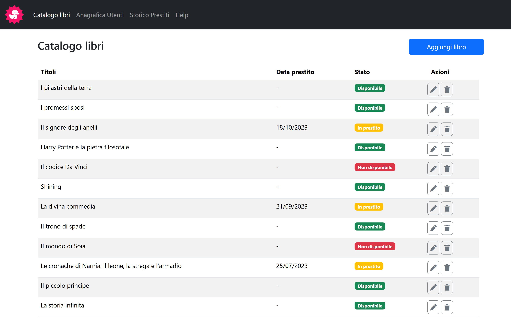
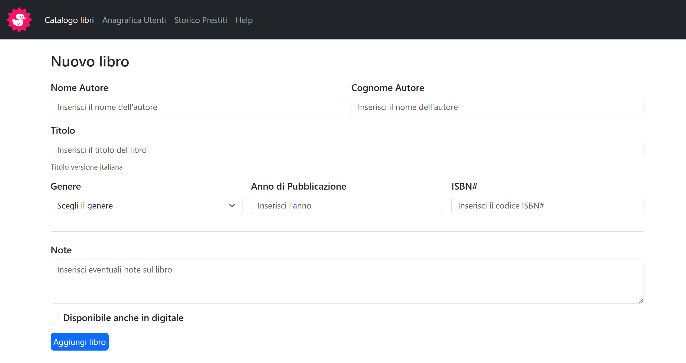

<h1 align="center">bootstrap-dashboard</h1>

###

  
  
  
  
  

###

###

Descrizione Ricreiamo il layout responsive di una dashboard, ovvero il pannello di controllo di una ipotetica applicazione web, seguendo gli screenshot allegati. La richiesta è realizzarlo utilizzando Bootstrap 5. Teniamo sempre sotto mano la documentazione della libreria per usare le caratteristiche principali nel modo corretto. Potrebbero tornarci utili anche componenti, classi helper, utilities etc.   Consigli: Ricordiamo che Bootstrap ha già molti componenti pronti all’uso che potete utilizzare direttamente come sono (as-is) o con qualche personalizzazione (customized). Alcuni li abbiamo già usati, altri li trovate come sempre nella documentazione ufficiale del framework. Ogni volta che volete usare un componente di Bootstrap fate sempre una prova su un altro file, copiate il codice di esempio dalla documentazione, osservate il comportamento, e solo quando siete sicuri che tutto funzioni come volete, integratelo nel vostro layout. Così facendo il codice CSS custom che scriverete risulterà abbastanza ridotto.

###

